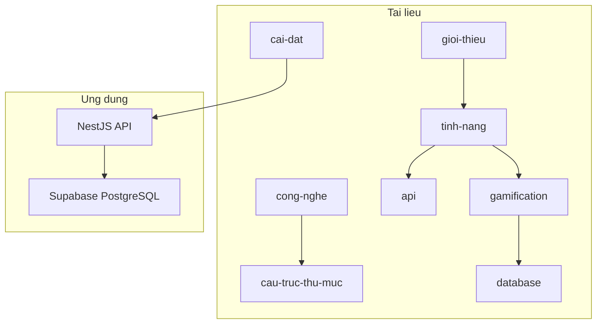

# Tài liệu Quizz App

Chào mừng đến với tài liệu dự án **Quizz App** — REST API backend cho nền tảng quiz trực tuyến với gamification.

## Mục lục

### Bắt đầu

| Tài liệu | Mô tả |
|----------|-------|
| [Giới thiệu](./gioi-thieu.md) | Tổng quan dự án, mục tiêu, đối tượng sử dụng |
| [Cài đặt & chạy dự án](./cai-dat.md) | Yêu cầu hệ thống, biến môi trường, scripts |

### Kiến trúc

| Tài liệu | Mô tả |
|----------|-------|
| [Công nghệ sử dụng](./cong-nghe.md) | Stack, module graph, auth flow |
| [Cấu trúc thư mục](./cau-truc-thu-muc.md) | Cây thư mục và trách nhiệm từng module |

### Nghiệp vụ

| Tài liệu | Mô tả |
|----------|-------|
| [Tính năng](./tinh-nang.md) | Mô tả module và luồng nghiệp vụ |
| [API Reference](./api.md) | Tóm tắt endpoint + ví dụ curl |
| [Database Schema](./database.md) | Bảng, quan hệ, enum |
| [Gamification](./gamification.md) | XP, level, streak, badge |

### Phát triển

| Tài liệu | Mô tả |
|----------|-------|
| [Hướng dẫn phát triển](./phat-trien.md) | Quy ước code, testing, checklist |
| [Known Issues](./known-issues.md) | Bug và inconsistency đã biết |

## Quick links

- **Swagger UI:** `http://localhost:3000/docs` (khi server chạy)
- **API base:** `http://localhost:3000/api`
- **File mẫu env:** [`.env.example`](../.env.example)
- **README gốc:** [`README.md`](../README.md)

## Sơ đồ tổng quan

