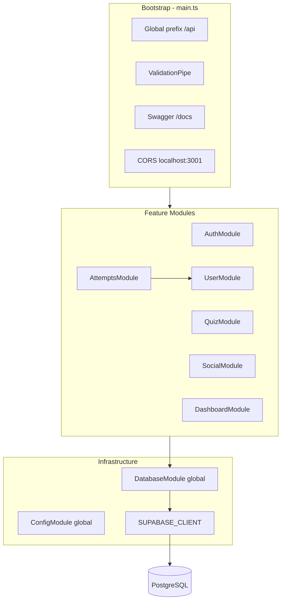
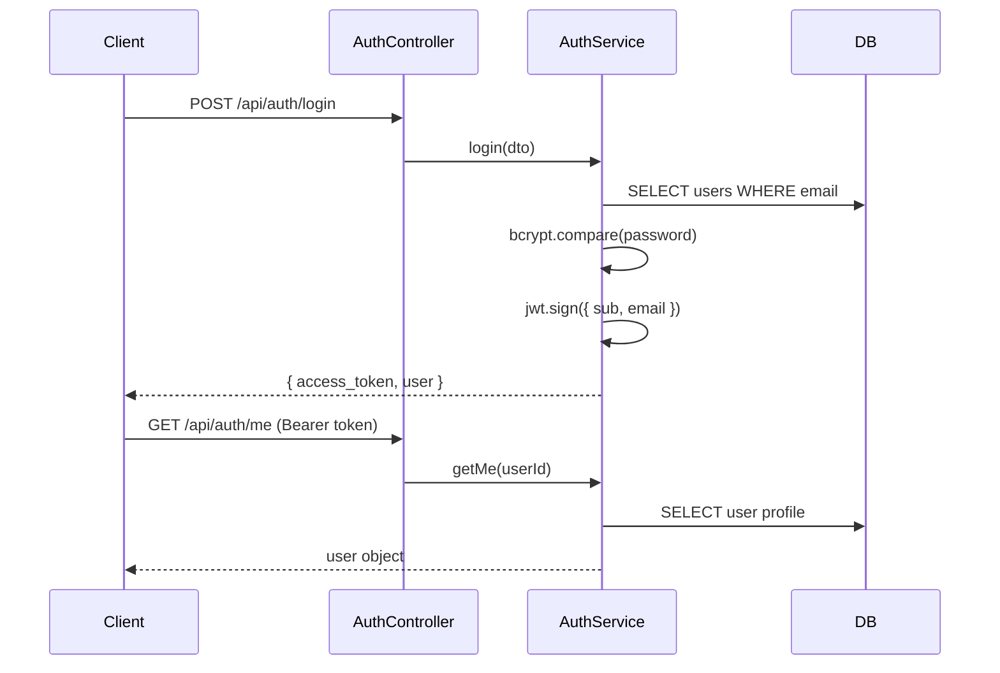

# Công nghệ sử dụng

## Stack tổng quan

| Lớp | Công nghệ | Phiên bản (chính) |
|-----|-----------|-------------------|
| Runtime | Node.js | 18+ |
| Framework | NestJS | 11.x |
| HTTP server | Express (`@nestjs/platform-express`) | — |
| Ngôn ngữ | TypeScript | 5.7 |
| Database | PostgreSQL qua Supabase | — |
| DB client | `@supabase/supabase-js` | 2.x |
| Authentication | JWT + Passport + bcrypt | — |
| Validation | class-validator, class-transformer | — |
| API docs | Swagger / OpenAPI (`@nestjs/swagger`) | — |
| Testing | Jest + Supertest | — |
| Seed data | `pg` + `@faker-js/faker` | — |
| Package manager | pnpm | — |

## Kiến trúc ứng dụng



## Pattern dữ liệu

Dự án **không dùng ORM** (TypeORM, Prisma, Sequelize). Thay vào đó:

1. `DatabaseModule` đăng ký global provider `SUPABASE_CLIENT`
2. Mỗi service inject client và truy vấn trực tiếp:

```typescript
this.supabase.from('users').select('id, email, username').eq('id', userId).single();
```

**Lý do phù hợp với dự án này:**
- Schema đã tồn tại trên Supabase/PostgreSQL
- Truy vấn đơn giản, không cần migration layer phức tạp
- Service role key cho phép backend bypass RLS khi cần

**Seed script** (`src/seeds/seed.ts`) dùng `pg` Pool trực tiếp với `DATABASE_URL` — tách biệt với runtime Supabase client.

## Module graph

```
AppModule
├── ConfigModule.forRoot({ isGlobal: true })
├── DatabaseModule          → SUPABASE_CLIENT (global)
├── AuthModule              → JwtModule, PassportModule, JwtStrategy
├── UserModule              → UserService, XpService, BadgeService, ActivityService
├── QuizModule              → QuizService
├── AttemptsModule          → imports UserModule
├── SocialModule            → SocialService
└── DashboardModule         → DashboardService
```

## Authentication flow



- JWT payload: `{ sub: userId, email }`
- Guard: `JwtAuthGuard` + decorator `@CurrentUser()` để lấy `{ id, email }`
- Token hết hạn mặc định: `7d` (cấu hình qua `JWT_EXPIRES_IN`)

## Validation & API docs

- **ValidationPipe** global: `whitelist`, `forbidNonWhitelisted`, `transform`
- DTO dùng decorator `class-validator` (`@IsEmail`, `@IsString`, `@IsOptional`, ...)
- Swagger tự generate từ decorator `@ApiTags`, `@ApiOperation`, `@ApiBearerAuth`

## Công cụ phát triển

| Công cụ | Mục đích |
|---------|----------|
| ESLint + Prettier | Lint và format code |
| Jest | Unit test (`*.spec.ts`) và E2E (`test/`) |
| Nest CLI | `nest build`, `nest start --watch` |
| Postman | Thư mục `postman/` chứa workspace globals |

## Tài liệu liên quan

- [Cấu trúc thư mục](./cau-truc-thu-muc.md)
- [Cài đặt](./cai-dat.md)
- [Hướng dẫn phát triển](./phat-trien.md)
