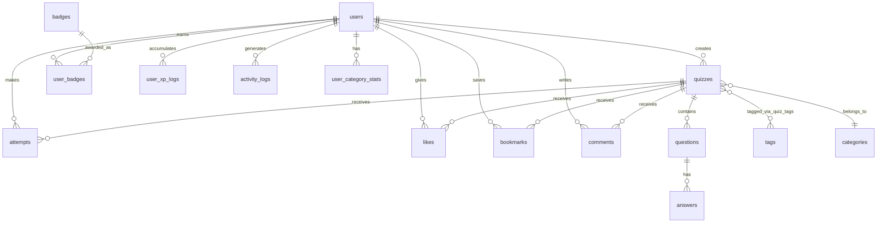

# Database Schema

Dự án sử dụng **PostgreSQL** trên Supabase. Không có migration files trong repo — schema được quản lý trên Supabase Dashboard. Tài liệu này mô tả các bảng và quan hệ suy ra từ code và seed script.

## Sơ đồ quan hệ (ER)



---

## Bảng chính

### `users`

Thông tin tài khoản và tiến trình gamification.

| Cột (chính) | Kiểu | Mô tả |
|-------------|------|-------|
| `id` | uuid | PK |
| `email` | text | Unique |
| `username` | text | Unique |
| `password_hash` | text | bcrypt hash |
| `avatar_url` | text | URL ảnh đại diện |
| `bio` | text | Giới thiệu |
| `total_xp` | int | Tổng XP tích lũy |
| `user_level` | int | Level hiện tại |
| `current_level_xp` | int | XP trong level hiện tại |
| `next_level_xp` | int | XP cần để lên level tiếp |
| `current_streak` | int | Chuỗi perfect score liên tiếp |
| `total_quizzes_played` | int | Tổng quiz đã chơi |
| `perfect_scores` | int | Số lần điểm tuyệt đối |
| `total_badges` | int | Số badge đã nhận |
| `created_at` | timestamptz | |
| `updated_at` | timestamptz | |

---

### `quizzes`

| Cột (chính) | Kiểu | Mô tả |
|-------------|------|-------|
| `id` | uuid | PK |
| `creator_id` | uuid | FK → users |
| `title` | text | |
| `description` | text | |
| `thumbnail_url` | text | |
| `category` | enum/text | Loại quiz (MATH, SCIENCE, ...) |
| `category_id` | uuid | FK → categories |
| `difficulty` | enum | EASY, MEDIUM, HARD |
| `tags` | text[] | Mảng slug tag |
| `visibility` | enum | `public` \| `private` |
| `play_count` | int | Số lần chơi |
| `like_count` | int | Số lượt like |
| `time_limit` | int | Giới hạn thời gian (giây) |
| `created_at` | timestamptz | |
| `updated_at` | timestamptz | |

---

### `questions`

| Cột (chính) | Kiểu | Mô tả |
|-------------|------|-------|
| `id` | uuid | PK |
| `quiz_id` | uuid | FK → quizzes |
| `question_text` / `content` | text | Nội dung câu hỏi |
| `type` | enum | Loại câu hỏi (xem bên dưới) |
| `points` | int | Điểm câu hỏi |
| `options` | jsonb | Mảng đáp án hiển thị |
| `correct_answer` | jsonb | Đáp án đúng (nhiều format) |
| `explanation` | text | Giải thích |
| `order_index` | int | Thứ tự trong quiz |
| `created_at` | timestamptz | |
| `updated_at` | timestamptz | |

### `answers`

Bảng phụ lưu đáp án chi tiết (song song với `options` jsonb trong `questions`).

| Cột (chính) | Kiểu | Mô tả |
|-------------|------|-------|
| `id` | uuid | PK |
| `question_id` | uuid | FK → questions |
| `answer_text` | text | Nội dung đáp án |
| `is_correct` | boolean | Đúng/sai |
| `order_index` | int | Thứ tự |

---

### `attempts`

| Cột (chính) | Kiểu | Mô tả |
|-------------|------|-------|
| `id` | uuid | PK |
| `user_id` | uuid | FK → users |
| `quiz_id` | uuid | FK → quizzes |
| `status` | enum | `in_progress` \| `submitted` |
| `score` | int | Điểm đạt được |
| `total_points` | int | Tổng điểm tối đa |
| `answers` | jsonb | Đáp án đã chọn |
| `xp_earned` | int | XP nhận được |
| `is_perfect` | boolean | Điểm tuyệt đối |
| `started_at` | timestamptz | |
| `completed_at` | timestamptz | |

---

### `categories`

| Cột | Mô tả |
|-----|-------|
| `id`, `name`, `slug` | Thông tin category |
| `icon_url`, `color_hex` | Hiển thị UI |

### `tags` + `quiz_tags`

- `tags`: `id`, `name`, `slug`
- `quiz_tags`: junction table (`quiz_id`, `tag_id`)

---

### Social tables

| Bảng | Cột chính | Mô tả |
|------|-----------|-------|
| `likes` | `user_id`, `quiz_id` | Like quiz (unique pair) |
| `bookmarks` | `user_id`, `quiz_id` | Bookmark quiz |
| `comments` | `user_id`, `quiz_id`, `content` | Bình luận |

---

### Gamification tables

| Bảng | Mô tả |
|------|-------|
| `badges` | Định nghĩa badge: key, name, rarity, condition_type, condition_value, xp_reward |
| `user_badges` | Badge user đã nhận (`user_id`, `badge_id`, `earned_at`) |
| `user_xp_logs` | Lịch sử cộng XP (`xp_amount`, `source_type`, `source_id`) |
| `activity_logs` | Timeline hoạt động (`type`, `metadata`) |
| `user_category_stats` | Thống kê theo category per user |

---

## Enum & constraint

### `difficulty_level`
`EASY` | `MEDIUM` | `HARD`

### `quiz_visibility`
`public` | `private`

### `question_type`
`SINGLE_CHOICE` | `MULTIPLE_CHOICE` | `TRUE_FALSE` | `FILL_BLANK` | `SHORT_TEXT`

### `attempt_status`
`in_progress` | `submitted`

### `badge` rarity
`common` | `rare` | `epic` | `legendary`

### `badge` condition_type

**Trong seed script:**
`quiz_count` | `score_streak` | `total_xp` | `perfect_score`

**Trong BadgeService (runtime):**
`quizz_count` | `streak` | `xp` | `perfect`

> Xem [Known issues](./known-issues.md) — hai bộ giá trị này chưa đồng nhất.

### `correct_answer` jsonb formats

| Format | Dùng cho |
|--------|----------|
| `{ "index": 0, "value": "..." }` | SINGLE_CHOICE |
| `{ "indices": [0, 2], "values": [...] }` | MULTIPLE_CHOICE |
| `{ "answer": true }` | TRUE_FALSE |
| `{ "answer": "text" }` | FILL_BLANK, SHORT_TEXT |

---

## Truy cập dữ liệu

### Runtime (API)
```typescript
// Inject SUPABASE_CLIENT
this.supabase.from('users').select('*').eq('id', userId).single();
```

### Seed script
```typescript
// Raw pg Pool với DATABASE_URL
await pool.query('INSERT INTO users (...) VALUES (...)');
```

---

## Tài liệu liên quan

- [Gamification](./gamification.md)
- [Cài đặt](./cai-dat.md)
- [Known issues](./known-issues.md)
