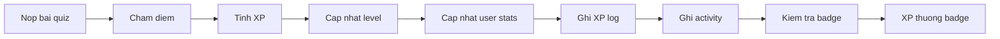

# Gamification

Hệ thống gamification của Quizz App bao gồm **XP**, **level**, **streak**, **badge** và **activity feed**. Logic chính nằm trong `src/users/xp.service.ts`, `badge.service.ts`, `activity.service.ts` và được kích hoạt từ `AttemptsService` khi user nộp bài.

## Tổng quan pipeline



---

## XP (Experience Points)

### Công thức

```
XP = floor((baseXp + scoreBonus + perfectBonus) × streakMult)
```

| Thành phần | Giá trị |
|-----------|---------|
| `baseXp` | 50 (cố định mỗi lần hoàn thành) |
| `scoreBonus` | `floor(score × 0.5)` |
| `perfectBonus` | 50 nếu điểm tuyệt đối (`is_perfect`), else 0 |
| `streakMult` | `min(1 + currentStreak × 0.05, 2.0)` |

### Ví dụ

| Tình huống | score | streak | XP |
|------------|-------|--------|-----|
| Bình thường | 6/10 | 0 | floor((50+3+0)×1.0) = **53** |
| Perfect, streak 3 | 10/10 | 3 | floor((50+5+50)×1.15) = **120** |
| Perfect, streak 20+ | 10/10 | 20 | floor((50+5+50)×2.0) = **210** (cap ×2) |

### XP log

Mỗi lần nhận XP được ghi vào `user_xp_logs`:
- `xp_amount` — số XP
- `source_type` — `quiz_attempt` hoặc `badge`
- `source_id` — ID attempt hoặc badge

---

## Level

### Công thức level-up

Mỗi level `L` yêu cầu `L × 1000` XP tích lũy để hoàn thành.

```
Level 1 → 2: cần 1000 XP
Level 2 → 3: cần thêm 2000 XP (tổng 3000)
Level 3 → 4: cần thêm 3000 XP (tổng 6000)
...
```

`XpService.computeLevel()` tính:
- `newLevel` — level mới
- `newCurrentXp` — XP còn lại trong level hiện tại
- `newNextXp` — XP cần để lên level tiếp
- `leveledUp` — boolean có lên level không

### Fields trên `users`

| Field | Mô tả |
|-------|-------|
| `total_xp` | Tổng XP tích lũy |
| `user_level` | Level hiện tại |
| `current_level_xp` | XP trong level hiện tại |
| `next_level_xp` | XP cần cho level tiếp |

---

## Streak

Streak đo số lần **perfect score** liên tiếp.

| Kết quả | Hành vi |
|---------|---------|
| Perfect score (`score === total_points`) | `current_streak += 1` |
| Không perfect | `current_streak = 0` |

Streak ảnh hưởng hệ số nhân XP (tối đa ×2.0).

---

## Badge

### Cách hoạt động

Sau mỗi lần submit quiz, `BadgeService.checkAndAwardBadges()`:

1. Load tiến trình user (`total_quizzes_played`, `current_streak`, `total_xp`, `perfect_scores`)
2. Load tất cả badge `is_active = true`
3. So sánh `condition_type` với giá trị user
4. Nếu đạt điều kiện và chưa có badge → trao badge

### Condition types (runtime)

| `condition_type` | So sánh với field user |
|------------------|------------------------|
| `quizz_count` | `total_quizzes_played` |
| `streak` | `current_streak` |
| `xp` | `total_xp` |
| `perfect` | `perfect_scores` |

### Khi nhận badge mới

1. Insert `user_badges`
2. Cộng `xp_reward` vào `total_xp` → ghi `user_xp_logs` (source `badge`)
3. Ghi `activity_logs` (type `badge_unlocked`)
4. Tăng `total_badges` trên user

### Badge rarity

`common` → `rare` → `epic` → `legendary`

API `GET /api/users/:id/badges` trả về:
```json
{
  "unlocked": [ /* badge đã nhận */ ],
  "locked": [ /* badge chưa đạt điều kiện */ ]
}
```

---

## Activity Feed

`ActivityService` ghi log vào `activity_logs`:

| Type | Khi nào |
|------|---------|
| `quiz_completed` | Sau submit quiz — metadata gồm score, XP, duration |
| `badge_unlocked` | Khi nhận badge mới |

API `GET /api/users/:id/activity` trả về timeline với cursor pagination (`?limit=20&cursor=`).

---

## Category Stats

Bảng `user_category_stats` theo dõi per-user per-category:
- `total_attempts`
- `correct_answers` / `total_questions` → **accuracy**
- `total_xp_earned`
- `last_played_at`

API: `GET /api/users/:id/category-stats`

---

## Milestones

`GET /api/users/:id/milestones` trả về tổng quan:
```json
{
  "total_xp": 2500,
  "total_badges": 5,
  "user_level": 3
}
```

---

## User stats cập nhật sau submit

| Field | Cập nhật |
|-------|----------|
| `total_quizzes_played` | +1 |
| `perfect_scores` | +1 nếu perfect |
| `current_streak` | +1 hoặc reset 0 |
| `total_xp` | + xp_earned (+ badge bonus nếu có) |
| `user_level` | Tính lại qua `computeLevel()` |

---

## Profile BFF endpoint

`GET /api/users/:id/profile/full` gộp trong một request:
- Profile cơ bản
- Category stats
- Badges (summary)
- Recent attempts
- Activity feed

Giúp frontend load trang profile nhanh hơn (Backend-for-Frontend pattern).

---

## Tài liệu liên quan

- [Tính năng](./tinh-nang.md)
- [Database schema](./database.md)
- [Known issues](./known-issues.md) — inconsistency badge/level fields
