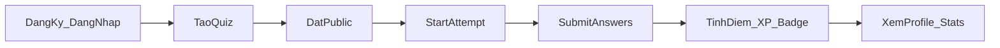

# Giới thiệu

## Quizz App là gì?

**Quizz App** là REST API backend cho nền tảng quiz trực tuyến. Người dùng có thể tạo quiz, chia sẻ công khai, làm bài và nhận điểm — đồng thời tích lũy XP, level, badge và streak như một trò chơi hóa (gamification).

Dự án được xây dựng bằng **NestJS 11** và **TypeScript**, lưu trữ dữ liệu trên **PostgreSQL** thông qua **Supabase**.

## Phạm vi hiện tại

Repo này chỉ chứa **backend API**. Không có mã nguồn frontend, nhưng API được cấu hình CORS cho client chạy tại `http://localhost:3001`.

Tài liệu API tương tác đầy đủ có sẵn qua **Swagger** tại `http://localhost:3000/docs` khi server đang chạy.

## Mục tiêu dự án

- Cung cấp API ổn định cho ứng dụng quiz (web/mobile)
- Hỗ trợ quản lý quiz đa dạng: nhiều loại câu hỏi, phân loại, độ khó, tag
- Theo dõi tiến trình người chơi: điểm số, XP, level, badge, lịch sử hoạt động
- Tích hợp tính năng xã hội: like, bookmark, comment trên quiz
- Cung cấp dashboard thống kê tổng hợp

## Đối tượng sử dụng

| Actor | Mô tả |
|-------|-------|
| **Khách (guest)** | Xem danh sách quiz public, đọc comment, xem profile người dùng |
| **Người chơi (player)** | Đăng ký/đăng nhập, làm quiz public, nhận XP/badge, like/bookmark/comment |
| **Người tạo quiz (creator)** | Tạo và quản lý quiz riêng, thêm/sửa/xóa câu hỏi, đặt visibility public/private |
| **Developer** | Tích hợp API qua Swagger, Postman hoặc client tự viết |

## Luồng nghiệp vụ chính

1. Người dùng đăng ký hoặc đăng nhập → nhận JWT
2. Người tạo quiz xây dựng nội dung và publish (`visibility: public`)
3. Người chơi bắt đầu attempt → trả lời câu hỏi → nộp bài
4. Hệ thống chấm điểm, cộng XP, cập nhật streak, kiểm tra badge
5. Profile hiển thị thống kê, lịch sử và hoạt động gần đây

## Tài liệu liên quan

- [Công nghệ sử dụng](./cong-nghe.md)
- [Cài đặt & chạy dự án](./cai-dat.md)
- [Tính năng chi tiết](./tinh-nang.md)
- [API Reference](./api.md)
