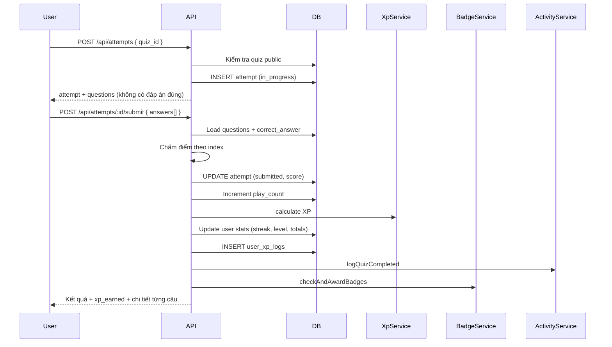
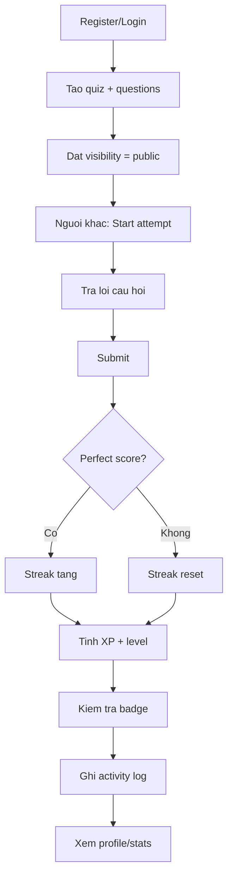

# Tính năng

Tài liệu này mô tả các module nghiệp vụ và luồng xử lý chính của Quizz App.

## 1. Authentication (`auth/`)

### Tính năng
- **Đăng ký** (`POST /api/auth/register`): tạo tài khoản mới, kiểm tra email/username trùng lặp, hash mật khẩu bằng bcrypt
- **Đăng nhập** (`POST /api/auth/login`): xác thực email/password, trả JWT
- **Thông tin hiện tại** (`GET /api/auth/me`): lấy profile user đang đăng nhập (yêu cầu JWT)

### Response mẫu
```json
{
  "access_token": "eyJhbGciOiJIUzI1NiIs...",
  "user": {
    "id": "uuid",
    "email": "user@example.com",
    "username": "player1",
    "avatar_url": null,
    "bio": null,
    "created_at": "2026-06-08T04:00:00.000Z"
  }
}
```

---

## 2. Quizzes (`quizzes/`)

### Tính năng chính

| Tính năng | Endpoint | Auth |
|-----------|----------|------|
| Danh sách quiz public | `GET /api/quizzes` | Không |
| Tạo quiz | `POST /api/quizzes` | JWT |
| Chi tiết quiz | `GET /api/quizzes/:id` | Không |
| Cập nhật quiz | `PATCH /api/quizzes/:id` | JWT (owner) |
| Xóa quiz | `DELETE /api/quizzes/:id` | JWT (owner) |
| Thêm câu hỏi | `POST /api/quizzes/:id/questions` | JWT (owner) |
| Sửa câu hỏi | `PATCH /api/questions/:id` | JWT (owner) |
| Xóa câu hỏi | `DELETE /api/questions/:id` | JWT (owner) |
| Sắp xếp lại câu hỏi | `PUT /api/quizzes/:id/questions/reorder` | JWT (owner) |
| Sửa đáp án | `PATCH /api/answers/:id` | JWT (owner) |
| Xóa đáp án | `DELETE /api/answers/:id` | JWT (owner) |
| Đổi visibility | `PATCH /api/quizzes/:id/visibility` | JWT (owner) |

### Tìm kiếm & lọc (`GET /api/quizzes`)

Query params:
- `search` — tìm theo title/description
- `category` — lọc theo tên category
- `difficulty` — `easy` | `medium` | `hard`
- `sort` — `newest` | `oldest` | `title`
- `page`, `limit` — phân trang

Response: `{ items, total, page, limit, totalPages }`

### Loại câu hỏi hỗ trợ

| Type | Mô tả |
|------|-------|
| `SINGLE_CHOICE` | Một đáp án đúng |
| `MULTIPLE_CHOICE` | Nhiều đáp án đúng |
| `TRUE_FALSE` | Đúng/Sai |
| `FILL_BLANK` | Điền vào chỗ trống |
| `SHORT_TEXT` | Trả lời ngắn |

### Quy tắc ownership
Chỉ `creator_id` của quiz mới được sửa/xóa quiz, câu hỏi và đáp án.

### Visibility
- `private` (mặc định khi tạo) — chỉ owner thấy
- `public` — hiển thị trong danh sách và cho phép làm bài

---

## 3. Attempts (`attempts/`)

### Luồng làm bài



### Endpoint chính

| Endpoint | Mô tả |
|----------|-------|
| `POST /api/attempts` | Bắt đầu attempt — chỉ quiz `public` |
| `POST /api/attempts/:id/submit` | Nộp đáp án, chấm điểm, cộng XP |
| `GET /api/attempts/:id` | Xem kết quả attempt (có breakdown từng câu) |

### Chấm điểm
- Client gửi `selected_answer_id` là **index 0-based** của option
- Hỗ trợ nhiều format `correct_answer`: `{ index }`, `{ indices }`, `{ value }`, `{ values }`
- Điểm = tổng `points` của các câu trả lời đúng
- Một attempt chỉ submit **một lần** (`in_progress` → `submitted`)

### Streak
- Perfect score → `current_streak` tăng 1
- Không perfect → streak reset về 0

---

## 4. Users & Gamification (`users/`)

### Profile

| Endpoint | Mô tả |
|----------|-------|
| `GET /api/users/:id/profile` | Profile cơ bản |
| `PATCH /api/users/:id/update` | Cập nhật username, avatar_url, bio |
| `GET /api/users/:id/profile/full` | Aggregate BFF — gộp profile + stats + badges + attempts + activity |

### Thống kê & tiến trình

| Endpoint | Mô tả |
|----------|-------|
| `GET /api/users/:id/quizzes` | Quiz do user tạo |
| `GET /api/users/:id/attempts` | Lịch sử làm bài |
| `GET /api/users/:id/category-stats` | Thống kê theo category (accuracy, XP) |
| `GET /api/users/:id/xp-history` | Dữ liệu biểu đồ XP (`?period=day\|week\|month`) |
| `GET /api/users/:id/recent-attempts` | Attempts gần đây (cursor pagination) |
| `GET /api/users/:id/badges` | Badge đã mở khóa + chưa mở khóa |
| `GET /api/users/:id/activity` | Activity feed (cursor pagination) |
| `GET /api/users/:id/milestones` | Tổng XP, tổng badge, level |

Chi tiết công thức XP, level, badge: xem [Gamification](./gamification.md).

---

## 5. Social (`social/`)

| Endpoint | Mô tả | Auth |
|----------|-------|------|
| `POST /api/quizzes/:id/like` | Toggle like — cập nhật `like_count` | JWT |
| `POST /api/quizzes/:id/bookmark` | Toggle bookmark | JWT |
| `GET /api/quizzes/:id/comments` | Danh sách comment (mới nhất trước) | Không |
| `POST /api/quizzes/:id/comments` | Thêm comment | JWT |
| `DELETE /api/comments/:id` | Xóa comment (chỉ owner) | JWT |

### Like toggle
- Chưa like → insert `likes` row, `like_count++`
- Đã like → delete row, `like_count--` (tối thiểu 0)

---

## 6. Dashboard (`dashboard/`)

`GET /api/dashboard` — thống kê tổng hợp (public):

```json
{
  "counts": {
    "totalUsers": 120,
    "totalQuizzes": 45,
    "totalCompletedAttempts": 380
  },
  "topPlayedQuizzes": [...],
  "topLikedQuizzes": [...],
  "topAttempts": [...]
}
```

---

## Luồng end-to-end: từ đăng ký đến nhận badge



## Tài liệu liên quan

- [API Reference](./api.md)
- [Gamification](./gamification.md)
- [Database schema](./database.md)
- [Known issues](./known-issues.md)
